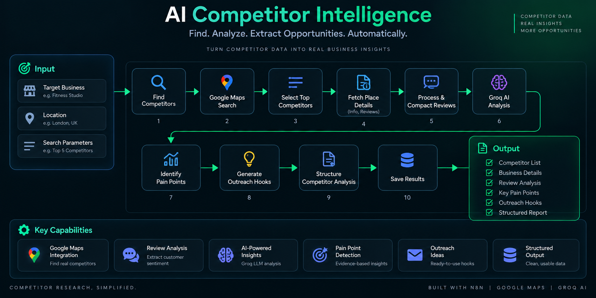

## 🧠 What This Does

Traditional competitor research often requires manually:

- Searching for competitors
- Opening multiple business listings
- Reading customer reviews
- Looking for recurring complaints
- Extracting business information
- Turning findings into actionable insights

This workflow automates that research process.

---

## ⚙️ Workflow Architecture



The workflow uses an n8n AI Agent connected to Google Maps research tools and Groq AI to investigate competitors, analyze review evidence, and produce structured intelligence.

---

```text
Target Business
      ↓
AI Agent
      ↓
Google Maps Research
      ↓
Business Details + Reviews
      ↓
Review Analysis
      ↓
Pain Point Detection
      ↓
Evidence-Based Insights
      ↓
Outreach Hooks
      ↓
Structured Output
      ↓
Google Sheets


⚙️ Workflow Architecture

The workflow is built around an n8n AI Agent with access to Google Maps research tools.

The agent can:

Receive the target business information
Search for relevant local competitors
Retrieve competitor business details
Retrieve competitor reviews
Analyze the returned review evidence
Identify recurring pain points
Assign confidence levels
Generate evidence-backed outreach hooks
Format the final result
Save the analysis to Google Sheets
Return the structured response
🔍 Research Pipeline
1. Input

The workflow accepts information such as:

Business name
Business category
City
Website
Optional competitor list

Example:

{
  "business_name": "Example Fitness Studio",
  "category": "Fitness",
  "city": "London, UK",
  "website": null
}
2. Competitor Discovery

When competitors are not supplied, the AI Agent can use the Google Maps Search tool to identify relevant local competitors.

The workflow focuses on finding strong local competitors rather than producing an unrestricted list of businesses.

3. Business Research

The AI Agent has access to tools for retrieving:

Business information
Place details
Customer reviews

This allows the research process to be performed within the workflow rather than requiring manual browsing.

4. Review Intelligence

Reviews are analyzed as evidence.

The system is specifically instructed to avoid inventing:

Complaints
Pain points
Review frequencies
Statistics
Quotes
Customer problems

Only review text returned by the research tools should be used as evidence.

5. Pain Point Detection

The AI identifies potential recurring problems from competitor reviews.

Each finding includes a confidence level.

The confidence logic is based on the number of distinct reviews supporting a finding:

3+ distinct reviews → High confidence
2 distinct reviews   → Medium confidence
1 distinct review    → Low confidence

Only medium- and high-confidence findings are eligible for cold-email hooks.

6. Outreach Intelligence

The workflow can transform supported competitor pain points into potential outreach hooks.

These hooks are grounded in the evidence discovered during competitor research rather than generic assumptions about the target business.

🤖 AI Architecture

The core intelligence layer uses an n8n AI Agent connected to a Groq Chat Model.

AI Agent Tools
AI Agent
├── Groq Chat Model
├── Google Maps Search
├── Google Maps Place Details
└── Google Maps Reviews

The agent decides how to use the available research tools to investigate competitors and gather the information required for analysis.

📤 Output

The workflow produces structured competitor intelligence containing fields such as:

{
  "target_business": {},
  "competitors_analyzed": [],
  "reviews_analyzed": 20,
  "top_pain_points": [],
  "all_pain_points": [],
  "cold_email_hooks": [],
  "generated_at": "2026-01-01T00:00:00Z"
}
Output includes
Target business
Competitors analyzed
Number of reviews analyzed
Top pain points
All identified pain points
Evidence-backed outreach hooks
Generation timestamp
🔗 Integrations
Technology	Purpose
n8n	Workflow orchestration
Groq AI	LLM reasoning
Google Maps	Competitor and business research
Google Sheets	Store structured results
Webhooks	Workflow input/output
🛡️ Reliability & Guardrails

The workflow is designed with several controls around AI-generated research.

Evidence-Based Analysis

AI findings must be supported by review evidence returned from the research tools.

No Invented Claims

The system is instructed not to invent:

Customer complaints
Statistics
Review frequencies
Quotes
Business problems
Confidence Thresholds

Pain points are assigned confidence based on supporting review evidence.

Controlled Outreach Generation

Cold-email hooks are only generated for findings that meet the defined confidence threshold.

Structured Output

The final AI response is formatted into a predictable JSON structure before being returned and stored.

📁 Repository Structure
ai-competitor-intelligence/
│
├── README.md
│
├── architecture/
│   └── overview.png
│
├── workflows/
│   └── ai-competitor-intelligence-sanitized.json
│
└── examples/
    ├── sample-input.json
    └── sample-output.json
📦 Workflow File

The repository includes a sanitized version of the n8n workflow:

workflows/ai-competitor-intelligence-sanitized.json

Credentials and runtime-specific data have been removed before publication.

The workflow architecture itself is preserved so it can be inspected and adapted in another n8n environment.

🧪 Example

Example input and representative output are available in:

examples/

The included output is a synthetic representative example intended to demonstrate the expected structure and should not be interpreted as live competitor research.

🔐 Security

No API keys, credentials, or private runtime state should be committed to this repository.

Before publishing the workflow, credential bindings and runtime-specific data were removed from the exported workflow.

When deploying the workflow, credentials should be configured through n8n's credential system rather than hardcoded inside workflow nodes.

🚀 Project Status

Completed — Independent Project

This project was built as part of an AI automation portfolio to demonstrate practical experience designing AI-powered research and business intelligence workflows with n8n.

👨‍💻 Developer

Mohammad Aqib

AI Automation Developer focused on:

n8n automation
AI agents
LLM workflows
API integrations
Business process automation
AI-powered research systems
Built with n8n + AI.
Structured Output
      ↓
Google Sheets
